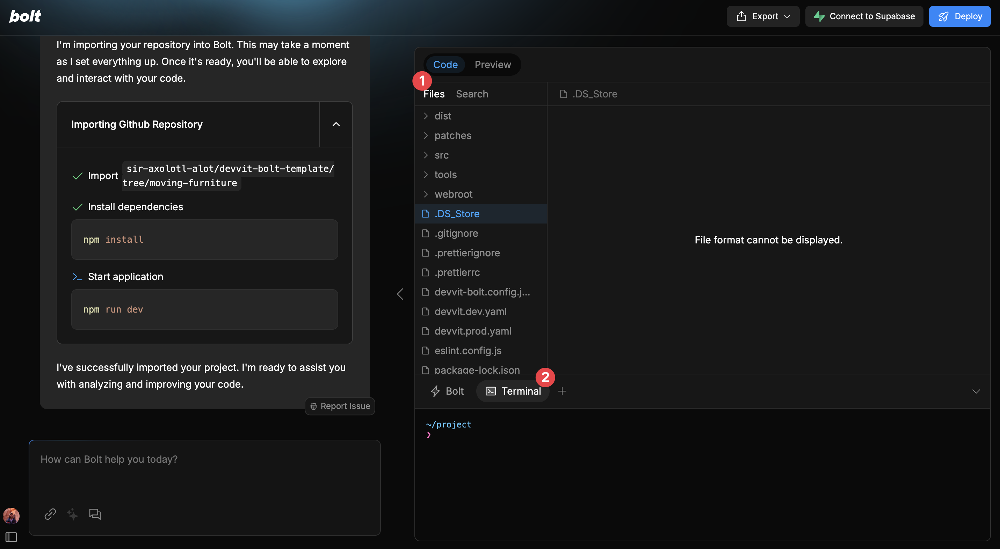

# Devvit Bolt Template

To use this template on Bolt.new, click here: https://bolt.new/github.com/sir-axolotl-alot/devvit-bolt-template

## Getting Started

> This requires you to have a Reddit account and Reddit developers account. Please [create an account](https://www.reddit.com/register/?dest=https%3A%2F%2Fdevelopers.reddit.com%2F) before continuing.

Once your Bolt template starts up you should see something like this:


Now, you need to get to your terminal:


Next, we need to login to devvit by running `npm run login`.


Once you're logged in, please create a subreddit on https://www.reddit.com/ by scrolling down to `Create a Community`. It's a good idea to keep your development subreddit private so that the logs you see in the console are only from you.

Once you have a new community, replace `YOUR_DEV_SUBREDDIT` in the `package.json`. Also, choose a name for your game and add it to `devvit.prod.yaml`.

There are two yaml files:

- `devvit.prod.yaml`: This is the production name of your application
- `devvit.dev.yaml`: This is the version unique to you. If you are working on a team, add this file to your gitignore so that you and other team members can develop on separate apps without stepping on each other.

Once you have an app name, run `npm run upload`. It will walk you through some prompts before uploading it to the developer portal.

Once you have that, you're ready to run: `npm run dev`.

This will do two things:

1. It will expose a development port for you to be able to code in Bolt in realtime.
2. On changes, it will submit builds to Reddit so that you can also see what your app looks like in production. This is a great place to test menu item actions, scheduled jobs, blocks, and more. Essentially, anything outside of the webview you need to see in reddit.

> Not seeing a post on your subreddit? Be sure to click the menu item to insert a new post!

## Build your web view with mocked responses

The template is prepared to help you build a Web View directly in Bolt's web container.
Because Bolt and Devvit can't communicate, Bolt will try to mock all responses that it expects from Devvit.

You can see and edit the Mocked Responses in `web-view-app/src/lib/DevvitMockedResponses.ts`

Once you're happy with your webview, let Bolt know. The LLM will give you instructions on how to test your app on Reddit

## Testing on Reddit

Because Bolt can't authenticate directly to Reddit, it should give you instructions on how to export the project, and run command line scripts locally to test your project.
It's important to remember to update the `devvit-bolt.config.json` to connect to the real Devvit backend and stop using mocked responses:

```js
/// devvit-bolt.config.json
{
  "useMockedResponses": false, // <-- Set this to false, before testing on Reddit
  "testSubreddit": "r/my_test_subreddit"
}
```

Alternatively, you can use the command `npm run playtest` instead of `devvit playtest` which should take care of that for you, and run on your test subreddit.

The usual workflow for testing the application after downloading the Bolt project is:

1- Update `devvit-bolt.config.json` with your test subreddit

2- Update `devvit.yaml` with your app name and version (you can always set version to 0.0.0 and let the CLI take care of the rest)

3- Run `npm install`

4- Run `devvit upload`

5- Run `npm run playtest`
